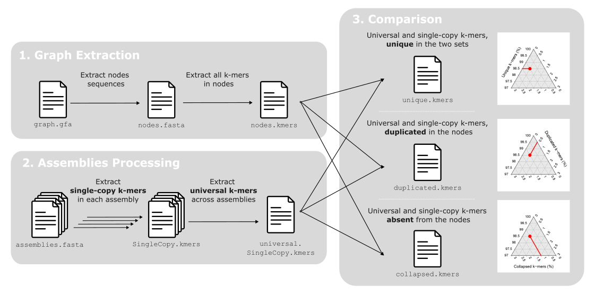

**P**an**G**enome **S**ingle **C**opy and **Un**iversal **K**mer counter (**PG-SCUnK**) aims to measure pan-genome graph quality using single-copy and universal K-mers.  
We assume that single-copy k-mers found in an assembly and universally present across all assemblies are orthologous, and should be found uniquely and in their full length in the nodes of the graph.

We thus propose simple metrics to describe a pan-genome graph based on the proportion of single-copy and universal K-mers composing the assemblies that are:
- _**Unique**_: Present only once and in full length in one of the nodes of the graph.
- _**Duplicated**_: Present multiple times in the graph.
- _**Collapsed**_: Fragmented over different nodes due to the aggregation of non-orthologous sequences.

The pipeline relies on [KMC](https://github.com/refresh-bio/KMC) to identify single-copy K-mers shared by all the assemblies (i.e., universal) composing a pan-genome graph.

bellow is a schematic representation of the PG-SCUnK workflow, please read the associated publication for details.



---

## 1. Installation

### Install the dependances in a dedicated environment.

PG-SCUnK requires _KMC_ to be installed and available in your `$PATH`.
Companions scripts require _samtools_ and _odgi_ for **_GFA2HaploFasta.bash_** and _zlib_ and _R_ for **_PG-SCUnK_plot.R_**

All the dependence can be installed by running:

```
# Using mamba 
mamba install bioconda::kmc=3.2.4 bioconda::samtools=1.21 bioconda::odgi=0.9.0 conda-forge::zlib=1.3.1 bioconda::r-base=4.2.0 

# Using conda
# conda install bioconda::kmc=3.2.4 bioconda::samtools=1.21 bioconda::odgi=0.9.0 conda-forge::zlib=1.3.1 bioconda::r-base=4.2.0
```

Creating a dedicated environment is a convenient way to ensure no interference with other software.

```
# Using mamba 
mamba create -n PG-SCUnK-env bioconda::kmc=3.2.4 bioconda::samtools=1.21 bioconda::odgi=0.9.0 conda-forge::zlib=1.3.1 bioconda::r-base=4.2.0
# then load the evironement before running PG-SCUnK with:
mamba activate PG-SCUnK-env

# Using conda
# conda create -n PG-SCUnK-env bioconda::kmc=3.2.4 bioconda::samtools=1.21 bioconda::odgi=0.9.0 conda-forge::zlib=1.3.1 bioconda::r-base=4.2.0 
# conda activate PG-SCUnK-env
```

### clone the directory

Download PG-SCUnK:

```
git clone https://github.com/cumtr/PG-SCUnK.git
```

### test run

To test PG-SCUnK, run:

```
cd PG-SCUnK
chmod +x ./PG-SCUnK
./PG-SCUnK
```

This command should print the help line for PG-SCUnK:

`Usage: ./PG-SCUnK -p <panGenome> -a <path/to/assemblies/> -o <outputDir/outputBasename> -t <tempDir> (-k <kmer_size> -v)`

---

## 2. Run PG-SCUnK

To run, PG-SCUnK require four informations:
- **`-p`** Point to the graph in `.gfa` format
- **`-a`** Point to the directory where all the assemblies that compose the graph are stored (PG-SCUnK assumes all the files is this directory than ends with `.fasta` are the assemblies to consider)
- **`-o`** Gives to PG-SCUnK the path + basename of the output file
- **`-t`** set the temp directory for PG-SCUnK to write temporary files

two other optional parameters can be provided: 
- **`-k`** is used to give to PG-SCUnK the k-mer size to use. default value is 100.
- **`-v`** state for the level of verbose. adding this flag (no values expected) make PG-SCUnK really verbose. mostly useful for debugging.

A typical command would be:
```
# mamba activate PG-SCUnK-env
./PG-SCUnK -p ./MyPanGenomeGraph.gfa -a ./InputAssemblies/ -o ./OutputPG-SCUnK/MyPanGenomeGraph.PG-SCUnK -t ./TEMP/ -k 100
```

This command produces five distinct files:

- `./OutputPG-SCUnK/MyPanGenomeGraph.PG-SCUnK.stats.txt` : Contains counts of _**single-copy and universal**_ K-mers, _**unique**_ K-mers, _**duplicated**_ K-mers, and _**collapsed**_ K-mers in the graph.

the four other files report the k-mers for the different categories:

- `./OutputPG-SCUnK/MyPanGenomeGraph.PG-SCUnK.all.txt`: List of all _**Single-Copy and Universal**_ K-mers.
- `./OutputPG-SCUnK/MyPanGenomeGraph.PG-SCUnK.unique.txt`: List of _**unique**_ K-mers.
- `./OutputPG-SCUnK/MyPanGenomeGraph.PG-SCUnK.duplicated.txt`: List of _**duplicated**_ K-mers.
- `./OutputPG-SCUnK/MyPanGenomeGraph.PG-SCUnK.collapsed.txt`: List of _**collapsed**_ K-mers.


### Compagnion scripts

PG-SCUnK comes with companion scripts.

**`scripts/GFA2HaploFasta.bash`**

This script is useful to extract the assemblies from a graph. **Before using it, make sure the graph was not trimmed in any way and contain the full assemblies** (row output from __pggb__ or __minigraph cactus__ for example). This script accept the graph in .gfa and .og format.

`Usage: ./scripts/GFA2HaploFasta.bash -p <panGenome.gfa> -t <tempDir> -o <outDir> -@ <threads>`

this script requires _samtools_ and _odgi_ to be present in you path. you can install them in the environment using: 
`mamba install -n PG-SCUnK-env bioconda::samtools=1.21 bioconda::odgi=0.9.0`

**`scripts/PG-SCUnK_plot.R`**

this script uses _R_ to make a triangular plot for a given a `.stats.txt` output file from PG-SCUnK.
You can install _R_ in the environment using : 
`mamba install -n PG-SCUnK-env bioconda::samtools=1.21 bioconda::R=0.9.0`

---

## Example of workflow

Below is an example of workflow to run PG-SCUnK for a pan-genome build for 50 e.coli and published [here](https://www.nature.com/articles/s41592-024-02430-3)

```
# Download and uncompress the graph in .gfa format.
wget https://zenodo.org/records/7937947/files/ecoli50.gfa.zst
unzstd ecoli50.gfa.zst 

mkdir TEMP

# run the first script to extract all the assemblies from the graph.
/path/to/PG-SCUnK/scripts/GFA2HaploFasta.bash -p ecoli50.gfa -t TEMP -o ecoli50 -@ 1

# Run PG-SCUnK
/path/to/PG-SCUnK/PG-SCUnK -p ecoli50.gfa -a ecoli50 -o Out_PG-SCUnK/ecoli50 -t TEMP -k 100

# Create a Ternary plot of the results
Rscript --vanilla ~/WORK/TOOLS/PG-SCUnK/scripts/PG-SCUnK_plot.R Out_PG-SCUnK/ecoli50.stats.txt Out_PG-SCUnK/ecoli50.out.pdf
```

---

## Licence

PG-SCUnK software is distributed under [GNU GPL 3 licence](https://www.gnu.org/licenses/gpl-3.0.txt).

